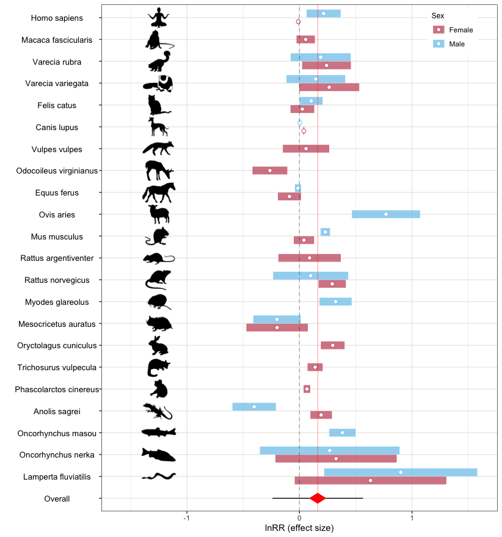
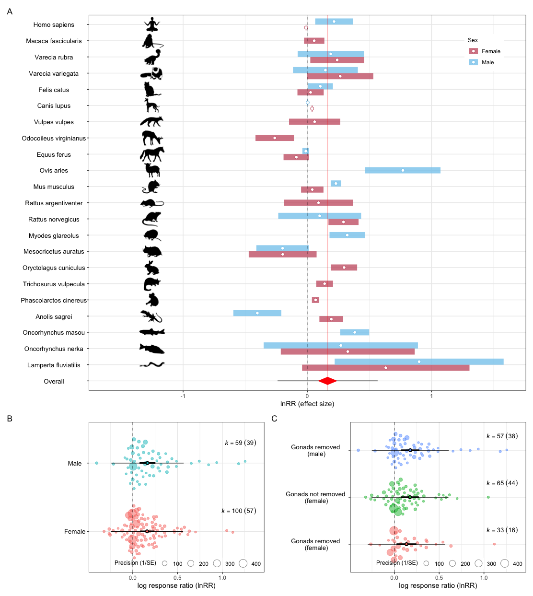
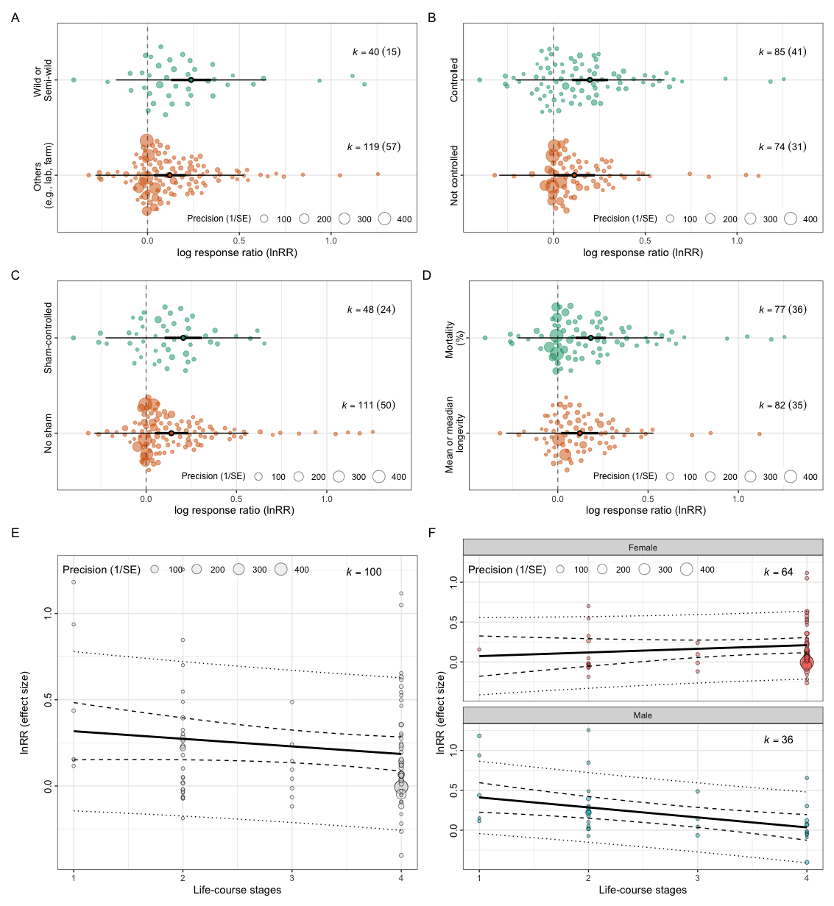
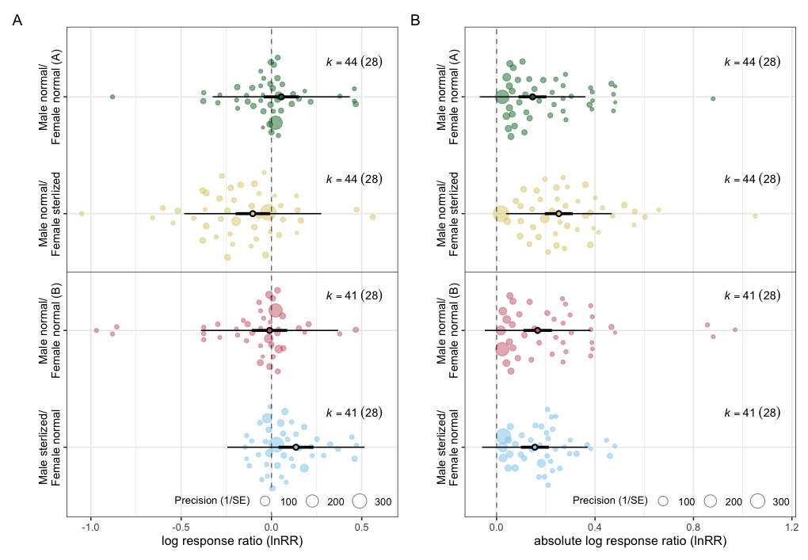
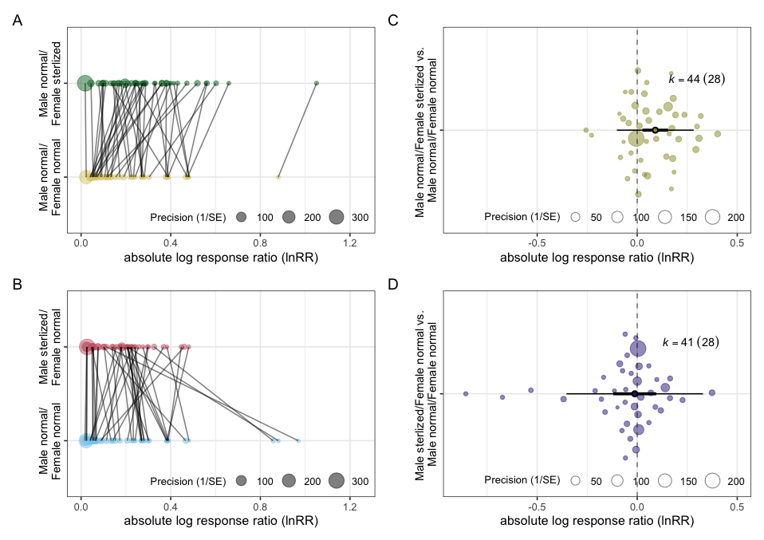
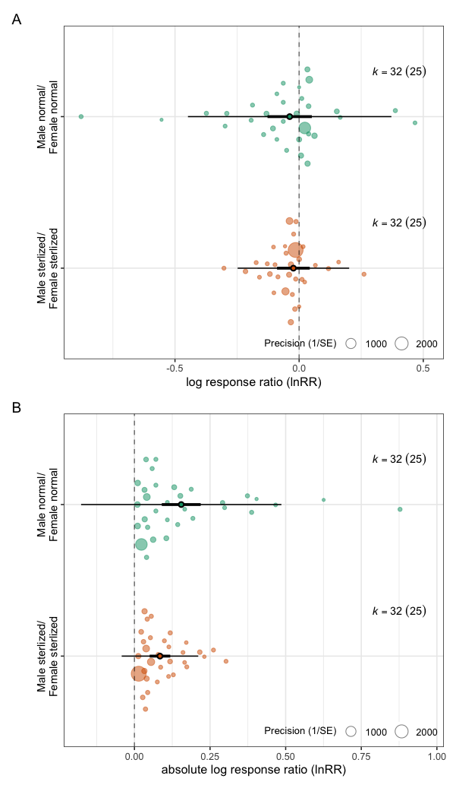

```{r setup, include = FALSE}
#kniter seetting
knitr::opts_chunk$set(
message = FALSE,
warning = FALSE, # no warnings
cache = TRUE,# Caching to save time when knitting
tidy = TRUE
#fig.width = 9
)

# clearning up
rm(list=ls())
```

# Litearture-based data (Meta-analysis)

## Setting-ups {.tabset .tabset-pills .tabset-fade}

### Loading packages

```{r}
# packages ####

#ochaRd
# 
# install.packages("devtools")
# install.packages("tidyverse")
# #install.packages("metafor")
# install.packages("patchwork")
# install.packages("R.rsp")
# 
# devtools::install_github("daniel1noble/orchaRd", force = TRUE, build_vignettes = TRUE)
# remotes::install_github("rvlenth/emmeans", dependencies = TRUE, build_opts = "") 
# 
# #emmeans
# remotes::install_github("rvlenth/emmeans", dependencies = TRUE, build_opts = "")
# # metafor
# install.packages("remotes")
# remotes::install_github("wviechtb/metafor")

# loading
pacman::p_load(tidyverse,
               metafor,
               pander,
               stringr,
               ape,
               kableExtra,
               patchwork,
               lme4,
               readxl,
               #emmeans,
               rotl,
               orchaRd,
               clubSandwich,
               MuMIn,
               png,
               grid,
               here,
               formatR,
               naniar,
               GoodmanKruskal,
               ggalluvial
)

# you may need to run this (we will plan to fix this)
library(groundhog)
#groundhog.library("emmeans", '2022-04-01')

# need for metafor to understand MuMin 
eval(metafor:::.MuMIn)
```

### Loading custom functions

```{r}
# custom functions 

# function for getting lnRR for proportional data (mortality)

lnrrp <- function(m1, m2, n1, n2) {
  # arcsine transforamtion
  asin_trans <- function(p) { asin(sqrt(p)) }
  # SD for arcsine distribution (see Wiki - https://en.wikipedia.org/wiki/Arcsine_distribution)
  var1 <- 1/8
  var2 <- 1/8
  # lnRR - with 2nd order correction
  lnrr <- log(asin_trans(m1)/asin_trans(m2)) + 
    0.5 * ((var1 / (n1 * asin_trans(m1)^2)) - (var2 / (n2 * asin_trans(m2)^2)))	
  
  var <- var1 / (n1 * asin_trans(m1)^2) + var1^2 / (2 * n1^2 * asin_trans(m1)^4)  + 
    var2 / (n2 * asin_trans(m2)^2) + var2^2 / (2 * n2^2 * asin_trans(m2)^4) 
  
  invisible(data.frame(yi = lnrr , vi = var))
}


# function to get to lnRR for longevity data (CV required)
# The method proposed in Nakagawa et al (2022) - missing SD method

lnrrm <- function(m1, m2, n1, n2, cv21, cv22) {
  # lnRR - with 2nd order correction
  lnrr <- log(m1/m2) + 
    0.5 * ((cv21 /n1) - (cv22 / n2))	
  
  var <- (cv21 / n1) + ((cv21^2) / (2 * n1^2))  + 
    (cv22/ n2) + ((cv22^2) / (2 * n2^2) )
  
  invisible(data.frame(yi = lnrr , vi = var))
}

# for folded normal distribution see: https://en.wikipedia.org/wiki/Folded_normal_distribution

# folded mean
folded_mu <-function(mean, variance){
  mu <- mean
  sigma <- sqrt(variance)
  fold_mu <- sigma*sqrt(2/pi)*exp((-mu^2)/(2*sigma^2)) + mu*(1 - 2*pnorm(-mu/sigma))
  fold_mu
} 

# folded variance
folded_v <-function(mean, variance){
  mu <- mean
  sigma <- sqrt(variance)
  fold_mu <- sigma*sqrt(2/pi)*exp((-mu^2)/(2*sigma^2)) + mu*(1 - 2*pnorm(-mu/sigma))
  fold_se <- sqrt(mu^2 + sigma^2 - fold_mu^2)
  # adding se to make bigger mean
  fold_v <-fold_se^2
  fold_v
} 


```

## Data preparation & processing {.tabset .tabset-pills .tabset-fade}

### Main data

```{r}
#dat_full <- read_csv(here("data", "dat_07072021.csv"), na = c("", "NA")) 
#dat_full <- read_csv(here("data", "data_15022022.csv"), na = c("", "NA"))
dat_full <- read_csv(here("data", "data_05052022.csv"), na = c("", "NA"))
#glimpse(dat_full)

#loading data ####

dat_full %>% filter(is.na(Treatment_lifespan_variable) == FALSE) %>% 
  filter(Type_of_sterilization != "Vasectomy") %>% 
  mutate_if(is.character, as.factor) -> dat


dim(dat)
dim(dat_full)
# separating two kinds

effect_type <- ifelse(str_detect(dat$Lifespan_parameter, "Me"), "longevity", "mortality")

#fix a typo in species name
dat$Species_Latin <- gsub("Macaca Fascicularis", "Macaca fascicularis", dat$Species_Latin) 
dat$Species_Latin <- gsub("Equus caballus", "Equus ferus", dat$Species_Latin)

# creating the phylo column
dat$Phylogeny <- sub(" ", "_",  dat$Species_Latin)
dat$Effect_type <- effect_type
dat$Effect_ID <- 1:nrow(dat)
# key variables
names(dat)
unique(dat$Species_Latin)

kable(dat, "html") %>% 
  kable_styling("striped", position = "left") %>% 
  scroll_box(width = "100%", 
    height = "250px")
```

### Calculating effect size for the main data

```{r}
# let's get CVs

dat %>% group_by(Study) %>% summarise(cv2_cont = mean((Error_control_SD/Control_lifespan_variable)^2, na.rm = T), cv2_trt = mean((Error_experimental_SD/Treatment_lifespan_variable)^2, na.rm = T), cv2_opst = mean((Error_opposite_sex_SD/Opposite_sex_lifespan_variable)^2, na.rm = T), n_cont = mean(Sample_size_control, na.rm = T), n_trt =  mean(Sample_size_sterilization, na.rm = T), n_opst =  mean(Sample_size_opposite_sex, na.rm = T)) %>% 
  ungroup() %>% 
  summarise(cv2_cont = weighted.mean(cv2_cont, n_cont, na.rm = T), cv2_trt = weighted.mean(cv2_trt, n_trt, na.rm = T), cv2_opst = weighted.mean(cv2_opst, n_opst, na.rm = T)) -> cvs

# lnRR
# using CV
dat$yi <- ifelse(effect_type == "longevity", lnrrm(dat$Treatment_lifespan_variable, dat$Control_lifespan_variable, dat$Sample_size_sterilization, dat$Sample_size_control, cvs[["cv2_trt"]],cvs[["cv2_cont"]])[[1]], lnrrp(dat$Treatment_lifespan_variable, dat$Control_lifespan_variable, dat$Sample_size_sterilization, dat$Sample_size_control)[[1]])

dat$vi <- ifelse(effect_type == "longevity", lnrrm(dat$Treatment_lifespan_variable, dat$Control_lifespan_variable, dat$Sample_size_sterilization, dat$Sample_size_control, cvs[["cv2_trt"]],cvs[["cv2_cont"]])[[2]], lnrrp(dat$Treatment_lifespan_variable, dat$Control_lifespan_variable, dat$Sample_size_sterilization, dat$Sample_size_control)[[2]])

# getting effect size for the long format 
# we create a longer data format

dat1 <- dat
dat2 <- dat

dat1$yi <- ifelse(effect_type == "longevity", 
                  lnrrm(dat$Control_lifespan_variable, dat$Opposite_sex_lifespan_variable,  
                        dat$Sample_size_control, dat$Sample_size_opposite_sex, 
                        cvs[["cv2_cont"]],cvs[["cv2_opst"]])[[1]], 
                  lnrrp(dat$Control_lifespan_variable, dat$Opposite_sex_lifespan_variable, 
                        dat$Sample_size_control,  dat$Sample_size_opposite_sex)[[1]])

dat1$vi <-ifelse(effect_type == "longevity", 
                 lnrrm(dat$Control_lifespan_variable,dat$Opposite_sex_lifespan_variable,  
                       dat$Sample_size_control, dat$Sample_size_opposite_sex, 
                       cvs[["cv2_cont"]],cvs[["cv2_opst"]])[[2]], 
                 lnrrp(dat$Control_lifespan_variable, dat$Opposite_sex_lifespan_variable, 
                       dat$Sample_size_control,  dat$Sample_size_opposite_sex)[[2]])

# here we create CM/F or CF/M
dat2$yi <- ifelse(effect_type == "longevity", 
                  lnrrm(dat$Treatment_lifespan_variable, dat$Opposite_sex_lifespan_variable,
                        dat$Sample_size_sterilization, dat$Sample_size_opposite_sex, 
                        cvs[["cv2_trt"]],cvs[["cv2_opst"]])[[1]], 
                  lnrrp(dat$Treatment_lifespan_variable, dat$Opposite_sex_lifespan_variable, 
                        dat$Sample_size_sterilization, dat$Sample_size_opposite_sex)[[1]])

dat2$vi <- ifelse(effect_type == "longevity", 
                  lnrrm(dat$Treatment_lifespan_variable, dat$Opposite_sex_lifespan_variable,
                        dat$Sample_size_sterilization, dat$Sample_size_opposite_sex, 
                        cvs[["cv2_trt"]],cvs[["cv2_opst"]])[[2]], 
                  lnrrp(dat$Treatment_lifespan_variable, dat$Opposite_sex_lifespan_variable, 
                        dat$Sample_size_sterilization, dat$Sample_size_opposite_sex)[[2]])


# putting two data frames
dat_long <- rbind(dat1, dat2)

# putt 2 new column

dat_long$Obs <- factor(1:dim(dat_long)[[1]])
dat_long$Comp_type <- as.factor(rep(c("both_normal", "one_castrated"), each = dim(dat_long)[[1]]/2))

dat_long$Comp_type_Sex <- paste(dat_long$Comp_type, dat_long$Sex, sep = "_")

dat_long$yi <- ifelse(dat_long$Comp_type_Sex ==  "one_castrated_Female" | dat_long$Comp_type_Sex == "both_normal_Female", -1*dat_long$yi, dat_long$yi)

dat_long %>% filter(!is.na(yi), !is.na(vi)) -> dat_long

dim(dat_long)
```

### Rodent data

This data is a subset of the main data only including data from rodents. This is used to test the effect of sterilization/castration on life stage (for these species, we were able to get more fine scale data). This dataset has two more variables: 1) Age_at_treatment (age in days when treatment was applied) and 2) Day_to_maturity (age in days when animals become mature). As also mentioned below, the analyses associated with this data set is post-hoc (not planned before data collection).

```{r}
#sdat <- read_csv(here("data", "data2_15022022.csv"), na = c("", "NA")) 
rdat <- read_csv(here("data", "data3_05052022.csv"), na = c("", "NA")) 

rdat <- rdat %>% filter(is.na(Treatment_lifespan_variable) == FALSE) %>% 
  #filter(Type_of_sterilization != "Vasectomy") %>% 
  mutate_if(is.character, as.factor) 

dim(rdat)

# separating two kinds

effect_type_r <- ifelse(str_detect(rdat$Lifespan_parameter, "Me"), "longevity", "mortality")


# effect-level ID
#dat$Species_Latin <- gsub("Macaca Fascicularis", "Macaca fascicularis", dat$Species_Latin) #fix a typo in species name
rdat$Effect_ID <- 1:nrow(rdat)
rdat$Phylogeny <- sub(" ", "_",  rdat$Species_Latin)
rdat$Effect_type <- effect_type_r

# key variables
names(rdat)
unique(rdat$Species_Latin)

kable(rdat, "html") %>% 
  kable_styling("striped", position = "left") %>% 
  scroll_box(width = "100%", 
    height = "250px")
```

### Calculating effect size for the rodent data

```{r}
# let's get CVs

rdat %>% group_by(Study) %>% summarise(cv2_cont = mean((Error_control_SD/Control_lifespan_variable)^2, na.rm = T), cv2_trt = mean((Error_experimental_SD/Treatment_lifespan_variable)^2, na.rm = T), cv2_opst = mean((Error_opposite_sex_SD/Opposite_sex_lifespan_variable)^2, na.rm = T), n_cont = mean(Sample_size_control, na.rm = T), n_trt =  mean(Sample_size_sterilization, na.rm = T), n_opst =  mean(Sample_size_opposite_sex, na.rm = T)) %>% 
  ungroup() %>% 
  summarise(cv2_cont = weighted.mean(cv2_cont, n_cont, na.rm = T), cv2_trt = weighted.mean(cv2_trt, n_trt, na.rm = T), cv2_opst = weighted.mean(cv2_opst, n_opst, na.rm = T)) -> cvs

# lnRR
# using CV
rdat$yi <- ifelse(effect_type_r == "longevity", lnrrm(rdat$Treatment_lifespan_variable, rdat$Control_lifespan_variable, rdat$Sample_size_sterilization, rdat$Sample_size_control, cvs[["cv2_trt"]],cvs[["cv2_cont"]])[[1]], lnrrp(rdat$Treatment_lifespan_variable, rdat$Control_lifespan_variable, rdat$Sample_size_sterilization, rdat$Sample_size_control)[[1]])

rdat$vi <- ifelse(effect_type_r == "longevity", lnrrm(rdat$Treatment_lifespan_variable, rdat$Control_lifespan_variable, rdat$Sample_size_sterilization, rdat$Sample_size_control, cvs[["cv2_trt"]],cvs[["cv2_cont"]])[[2]], lnrrp(rdat$Treatment_lifespan_variable, rdat$Control_lifespan_variable, rdat$Sample_size_sterilization, rdat$Sample_size_control)[[2]])

str(rdat)
```

This dataset is a part of the full data and only has data from rodent species. 

### All-combination data

This data sets is a subset of the main data and this includes only study which has all 4 groups: 1) control females, 2) control males, 3) treated females and 4) treated males.

```{r}
#sdat <- read_csv(here("data", "data2_15022022.csv"), na = c("", "NA")) 
sdat <- read_csv(here("data", "data2_19042022.csv"), na = c("", "NA")) 
effect_type_s <- ifelse(str_detect(sdat$Lifespan_parameter, "Me"), "longevity", "mortality")


# effect-level ID

sdat$Effect_ID <- 1:nrow(sdat)
sdat$Phylogeny <- sub(" ", "_",  sdat$Species_Latin)
sdat$Effect_type <- effect_type_s

kable(sdat, "html") %>% 
  kable_styling("striped", position = "left") %>% 
  scroll_box(width = "100%", 
    height = "250px")
```


### Calculating effect size for the matching data

```{r}
# we create a longer data format

sdat1 <- sdat
sdat2 <- sdat
# lnRR

# here we create the ratio of M/F
sdat1$yi <- ifelse(effect_type_s == "longevity", 
                  lnrrm(sdat$Male_control_lifespan_variable, sdat$Female_control_lifespan_variable,
                        sdat$Sample_size_male_control, sdat$Sample_size_female_control, 
                        cvs[["cv2_cont"]],cvs[["cv2_cont"]])[[1]], 
                  lnrrp(sdat$Male_control_lifespan_variable, sdat$Female_control_lifespan_variable, 
                        sdat$Sample_size_male_control,  sdat$Sample_size_female_control)[[1]])

sdat1$vi <- ifelse(effect_type_s == "longevity", 
                  lnrrm(sdat$Male_control_lifespan_variable, sdat$Female_control_lifespan_variable,
                        sdat$Sample_size_male_control, sdat$Sample_size_female_control, 
                        cvs[["cv2_cont"]],cvs[["cv2_cont"]])[[2]], 
                  lnrrp(sdat$Male_control_lifespan_variable, sdat$Female_control_lifespan_variable, 
                        sdat$Sample_size_male_control,  sdat$Sample_size_female_control)[[2]])

# here we create CM/CF
sdat2$yi <- ifelse(effect_type_s == "longevity", 
                  lnrrm(sdat$Male_sterilization_lifespan_variable, sdat$Female_sterilization_lifespan_variable,
                        sdat$Sample_size_male_sterilization, sdat$Sample_size_female_sterilization, 
                        cvs[["cv2_trt"]],cvs[["cv2_trt"]])[[1]], 
                  lnrrp(sdat$Male_sterilization_lifespan_variable, sdat$Female_sterilization_lifespan_variable, 
                        sdat$Sample_size_male_sterilization,  sdat$Sample_size_female_sterilization)[[1]])

sdat2$vi <-  ifelse(effect_type_s == "longevity", 
                   lnrrm(sdat$Male_sterilization_lifespan_variable, sdat$Female_sterilization_lifespan_variable,
                         sdat$Sample_size_male_sterilization, sdat$Sample_size_female_sterilization, 
                         cvs[["cv2_trt"]],cvs[["cv2_trt"]])[[2]], 
                   lnrrp(sdat$Male_sterilization_lifespan_variable, sdat$Female_sterilization_lifespan_variable, 
                         sdat$Sample_size_male_sterilization,  sdat$Sample_size_female_sterilization)[[2]])

# merging sdata frames
sdat_long <- rbind(sdat1, sdat2)

# putt 2 new column

sdat_long$Obs <- factor(1:dim(sdat_long)[[1]])
sdat_long$Comp_type <- as.factor(rep(c("both_normal", "both_castrated"), each = dim(sdat_long)[[1]]/2))

```

### Meta-data

```{r}
#sdat <- read_csv(here("data", "data2_15022022.csv"), na = c("", "NA")) 
mdat <- read_csv(here("data", "data_meta-data.csv")) 


kable(mdat, "html") %>% 
  kable_styling("striped", position = "left") %>% 
  scroll_box(width = "100%", 
    height = "250px")
```

## Summarise the dataset {.tabset .tabset-pills .tabset-fade} 

### Visualising missing data

```{r missing data, echo = FALSE}
#vis_miss(dat) #mostly data is missing at comment fields

vis_miss(dat) +
  theme(plot.title = element_text(hjust = 0.5, vjust = 3), 
        plot.margin = margin(t = 0.5, r = 2, b = 1, l = 1, unit = "cm")) +
  ggtitle("Missing data overall") #no mising values
```


### General summary   

 - Number of effect sizes: `r length(unique(dat$Effect_ID))`   
 - Number of studies: `r length(unique(dat$Study))`   
 - Publication years: from `r min(dat$Year, na.rm = TRUE)` to `r max(dat$Year, na.rm = TRUE)`    
 - Simple list of studies as short references: `r unique(dat$Study)`     
 - Number of species: `r length(unique(dat$Species_Latin))`     
 - Simple list of species Latin names (also stored in "Phylogeny" variable): `r unique(dat$Species_Latin)`    
 - Number of data points for females: `r length(which(dat$Sex=="Female"))`, and data points form males: `r length(which(dat$Sex=="Male"))`    
 

```{r key variables simple tables}
#Key variables: Sex, Gonads_removed, Wild_or_semi_wild, Controlled_treatments, Effect_type, Maturity_at_treatment_ordinal (ordinal with NA), 
#names(dat)

#check how crossed with Sex (relevant to both sexes or not?)
table(dat$Species_Latin, dat$Sex)
table(dat$Wild_or_semi_wild, dat$Sex)
table(dat$Gonads_removed, dat$Sex) #always Yes in Males
table(dat$Controlled_treatments, dat$Sex)
table(dat$Maturity_at_treatment_ordinal, dat$Sex) #table(dat$Maturity_at_treatment)
table(dat$Effect_type, dat$Sex)

#check how crossed with Wild_or_semi_wild
table(dat$Gonads_removed, dat$Wild_or_semi_wild)
table(dat$Controlled_treatments, dat$Wild_or_semi_wild)
table(dat$Maturity_at_treatment_ordinal, dat$Wild_or_semi_wild) 
table(dat$Effect_type, dat$Wild_or_semi_wild)

#check how crossed with Gonads_removed
table(dat$Wild_or_semi_wild, dat$Gonads_removed)
table(dat$Controlled_treatments, dat$Gonads_removed)
table(dat$Maturity_at_treatment_ordinal, dat$Gonads_removed) 
table(dat$Effect_type, dat$Gonads_removed)

#check how crossed with Controlled_treatments
table(dat$Wild_or_semi_wild, dat$Controlled_treatments)
table(dat$Gonads_removed, dat$Controlled_treatments)
table(dat$Maturity_at_treatment_ordinal, dat$Controlled_treatments)
table(dat$Effect_type, dat$Controlled_treatments)

#check how crossed with Effect_type
table(dat$Wild_or_semi_wild, dat$Effect_type)
table(dat$Gonads_removed, dat$Effect_type)
table(dat$Controlled_treatments, dat$Effect_type)
table(dat$Maturity_at_treatment_ordinal, dat$Effect_type)
```

### Key predictors (moderators)   

Visualise missing data in 6 key variables (moderators):   
 - Sex,   
 - Wild_or_semi_wild,   
 - Maturity_at_treatment_ordinal,  
 - Gonads_removed,   
 - Controlled_treatments,   
 - Effect_type  
  
```{r key variables missing values, echo = FALSE}
#create a data subset wth key variables only
dat_key <- dat %>% select(Sex, Wild_or_semi_wild, Maturity_at_treatment_ordinal, Gonads_removed, Controlled_treatments, Effect_type)

vis_miss(dat_key) +
  theme(plot.title = element_text(hjust = 0.5, vjust = 3), 
        plot.margin = margin(t = 0.5, r = 2, b = 1, l = 1, unit = "cm")) +
  ggtitle("Missing data in key variables") #32% mising values in Maturity_at_treatment_ordinal only
```

### Visualize pairwise associations between 6 key variables:   

```{r key variables associations, echo = FALSE}
#names(dat_key)
#useGoodman and Kruskal’s τ measure of association between categorical predictor variables (function from package GoodmanKruskal: https://cran.r-project.org/web/packages/GoodmanKruskal/vignettes/GoodmanKruskal.html)
GKmatrix <- GKtauDataframe(subset(dat_key))
#par(mar=c(1,1,2,4))
plot(GKmatrix)
```


Alluvial diagrams for key predictor variables (moderators) - two groups of 3 moderators, grouped by similarity:  

### For Sex, Gonads_removed, $ Maturity_at_treatment_ordinal (changed NA to 0)  


```{r alluvial plots A, results = 'hide'}
#use ggalluvial (https://cran.r-project.org/web/packages/ggalluvial/vignettes/ggalluvial.html)

# create a frequency table for first 3 moderator variables
# freq_1 <- as.data.frame(table(dat$Sex, dat$Gonads_removed, dat$Maturity_at_treatment_ordinal)) %>% rename(Sex = Var1, Gonads_removed = Var2, Maturity_at_treatment_ordinal = Var3)
# is_alluvia_form(as.data.frame(freq_1), axes = 1:3, silent = TRUE)
# #freq_1 %>% filter(Freq != 0) %>% arrange(desc(Freq)) #collapesd table of values, without 0s

 
# ggplot(data = freq_1,
#   aes(axis1 = Sex, axis2 = Gonads_removed, axis3 = Maturity_at_treatment_ordinal, y = Freq)) +
#   geom_alluvium(aes(fill = Sex)) +
#   geom_stratum(aes(fill = Sex))+
#   geom_text(stat = "stratum", aes(label = after_stat(stratum))) +
# #theme_minimal() +
#   theme_void() +
#   theme(legend.position = "none",
#         plot.title = element_text(hjust = 0.5, vjust = 3),
#         axis.title.x = element_text(),
#         axis.text.x = element_text(face="bold")) +
#   scale_x_discrete(limits = c("Sex", "Gonads removed", "Maturity class"), expand = c(0.15, 0.05), position = "top") +
#   scale_fill_brewer(palette = "Set3") +
#   ggtitle("A. Subjects sex, manipulation type and maturity class")

#as above but with, but with Gonads_removed as first column, and different colours
# ggplot(data = freq_1,
#   aes(axis1 = Gonads_removed, axis2 = Sex, axis3 = Maturity_at_treatment_ordinal, y = Freq)) +
#   geom_alluvium(aes(fill = Gonads_removed)) +
#   geom_stratum(aes(fill = Gonads_removed))+
#   geom_text(stat = "stratum", aes(label = after_stat(stratum))) +
#   theme_minimal() +
# #  theme_void() +
#   theme(legend.position = "none",
#         plot.title = element_text(hjust = 0.5, vjust = 3),
#         axis.title.x = element_text(),
#         axis.text.x = element_text(face="bold")) +
#   scale_x_discrete(limits = c("Gonads_removed", "Sex", "Maturity class"), expand = c(0.15, 0.05), position = "top") +
#   scale_fill_brewer(palette = "Pastel2") +
#   ggtitle("A. Subjects sex, manipulation and maturity ")

#NOTE: all rows with NA in Maturity class are removed from the plot 
#recode NA as 0
dat$Maturity_at_treatment_ordinal2 <- dat$Maturity_at_treatment_ordinal
dat$Maturity_at_treatment_ordinal2[is.na(dat$Maturity_at_treatment_ordinal2)] <- 0
# create a frequency table for first 3 moderator variables
freq_1 <- as.data.frame(table(dat$Sex, dat$Gonads_removed, dat$Maturity_at_treatment_ordinal2)) %>% rename(Sex = Var1, Gonads_removed = Var2, Maturity_at_treatment_ordinal = Var3)
is_alluvia_form(as.data.frame(freq_1), axes = 1:3, silent = TRUE)
#freq_1 %>% filter(Freq != 0) %>% arrange(desc(Freq)) #collapesd table of values, without 0s

 
# ggplot(data = freq_1,
#   aes(axis1 = Sex, axis2 = Gonads_removed, axis3 = Maturity_at_treatment_ordinal, y = Freq)) +
#   geom_alluvium(aes(fill = Sex)) +
#   geom_stratum(aes(fill = Sex))+
#   geom_text(stat = "stratum", aes(label = after_stat(stratum))) +
# #theme_minimal() +
#   theme_void() +
#   theme(legend.position = "none",
#         plot.title = element_text(hjust = 0.5, vjust = 3),
#         axis.title.x = element_text(),
#         axis.text.x = element_text(face="bold")) +
#   scale_x_discrete(limits = c("Sex", "Gonads removed", "Maturity class"), expand = c(0.15, 0.05), position = "top") +
#   scale_fill_brewer(palette = "Set3") +
#   ggtitle("A. Subjects sex, manipulation type and maturity class")

#as above but with, but with Gonads_removed as first column, and different colours
ggplot(data = freq_1,
  aes(axis1 = Gonads_removed, axis2 = Sex, axis3 = Maturity_at_treatment_ordinal, y = Freq)) +
  geom_alluvium(aes(fill = Gonads_removed)) +
  geom_stratum(aes(fill = Gonads_removed))+
  geom_text(stat = "stratum", aes(label = after_stat(stratum))) +
  theme_minimal() +
#  theme_void() +
  theme(legend.position = "none",
        plot.title = element_text(hjust = 0.5, vjust = 3),
        axis.title.x = element_text(),
        axis.text.x = element_text(face="bold")) +
  scale_x_discrete(limits = c("Gonads_removed", "Sex", "Maturity class"), expand = c(0.15, 0.05), position = "top") +
  scale_fill_brewer(palette = "Pastel2") +
  ggtitle("A. Subjects sex, manipulation and maturity ")
```

### For Wild_or_semi_wild, Controlled_treatments, & Effect_type (Outcome type)

```{r alluvial plots B, results = 'hide'}
# create a frequency table for next 3 moderator variables
freq_2 <- as.data.frame(table(dat$Wild_or_semi_wild, dat$Controlled_treatments, dat$Effect_type)) %>% rename(Wild_or_semi_wild = Var1, Controlled_treatments = Var2, Effect_type = Var3)
is_alluvia_form(as.data.frame(freq_2), axes = 1:3, silent = TRUE)
#freq_2 %>% filter(Freq != 0) %>% arrange(desc(Freq)) #collapesd table of values, without 0s

ggplot(data = freq_2,
  aes(axis1 = Wild_or_semi_wild, axis2 = Controlled_treatments, axis3 = Effect_type, y = Freq)) +
  geom_alluvium(aes(fill = Wild_or_semi_wild)) +
  geom_stratum(aes(fill = Wild_or_semi_wild))+
  geom_text(stat = "stratum", aes(label = after_stat(stratum))) +
  theme_minimal() +
#  theme_void() +
  theme(legend.position = "none",
        plot.title = element_text(hjust = 0.5, vjust = 3),
        axis.title.x = element_text(),
        axis.text.x = element_text(face="bold")) +
  scale_x_discrete(limits = c("Wild_or_semi_wild", "Controlled_treatments", "Outcome type"), expand = c(0.15, 0.05), position = "top") +
  scale_fill_brewer(palette = "Pastel1") +
  ggtitle("B. Experimental settings and outcome type")

#names(dat_key)
```


### For Gonads_removed, Wild_or_semi_wild, Controlled_treatments, & Effect_type (Outcome type) 

```{r alluvial plots C, results = 'hide'}
# create a frequency table for next 3 moderator variables
freq_3 <- as.data.frame(table(dat$Gonads_removed, dat$Wild_or_semi_wild, dat$Effect_type)) %>% rename(Gonads_removed = Var1, Wild_or_semi_wild = Var2, Effect_type = Var3)
is_alluvia_form(as.data.frame(freq_3), axes = 1:3, silent = TRUE)
#freq_2 %>% filter(Freq != 0) %>% arrange(desc(Freq)) #collapesd table of values, without 0s

ggplot(data = freq_3,
  aes(axis1 = Gonads_removed, axis2 = Wild_or_semi_wild, axis3 = Effect_type, y = Freq)) +
  geom_alluvium(aes(fill = Gonads_removed)) +
  geom_stratum(aes(fill = Gonads_removed))+
  geom_text(stat = "stratum", aes(label = after_stat(stratum))) +
  theme_minimal() +
#  theme_void() +
  theme(legend.position = "none",
        plot.title = element_text(hjust = 0.5, vjust = 3),
        axis.title.x = element_text(),
        axis.text.x = element_text(face="bold")) +
  scale_x_discrete(limits = c("Gonads_removed", "Wild_or_semi_wild", "Outcome type"), expand = c(0.15, 0.05), position = "top") +
  scale_fill_brewer(palette = "Set3") +
  ggtitle("C. Manipulation, subject and outcome types")

#names(dat_key)
```

This just shows a different combination of predictor variables (moderators) from plots A and B.      

## Building phylogenetic tree {.tabset .tabset-pills .tabset-fade}

### Setting up

```{r get species list, message = FALSE, echo = TRUE, eval = FALSE, warning = FALSE}
names(dat)
myspecies <- as.character(unique(dat$Species_Latin)) #get list of species
#str_sort(myspecies) #visual check
#length(myspecies) #23 species
#length(unique(myspecies)) #23 unique species names
```

Using *rotl* package to retrieve synthetic species tree from Open Tree of Life: Rotl is an R package (<https://peerj.com/preprints/1471/>) allowing access to synthetic phylogenetic tree available at Open Tree of Life database (<https://opentreeoflife.org/>).

```{r rotl find species, message = FALSE, echo = TRUE, eval = FALSE, warning = FALSE}
taxa <- tnrs_match_names(names = myspecies)
dim(taxa) #40 specias - all matched
table(taxa$approximate_match) #1 approximate match
taxa[taxa$approximate_match == TRUE, ] ##lamperta fluviatilis (search_string) will be presented as Perca fluviatilis (uniquw_name)
```

### Get the initial tree

```{r rotl species tree, warning = FALSE, results=FALSE, eval= FALSE, echo = TRUE}
tree <- tol_induced_subtree(ott_ids = taxa[["ott_id"]], label_format = "name")  
# plot(tree, cex=.6, label.offset =.1, no.margin = TRUE) visual check
```

### Check matching species & labels

```{r re-check tree labels, eval=F, echo=T}
#check overlap and differences with the taxa list
intersect(gsub("_"," ", tree$tip.label), myspecies) #22
setdiff(gsub("_"," ", tree$tip.label), myspecies) # "Perca fluviatilis"  
setdiff(myspecies, gsub("_"," ", tree$tip.label)) # "Lamperta fluviatilis"
tree$tip.label <- gsub("Perca_fluviatilis", "Lamperta_fluviatilis", tree$tip.label) #replace with the original name

#tree <- drop.tip(tree, "Equus_caballus")
#re-check overlap and differences with myspecies list
#intersect(myspecies, tree2$tip.label) #23
#setdiff(myspecies, tree2$tip.label) #0
#setdiff(tree2$tip.label, myspecies) #0

#check if the tree is really binary 
is.binary.tree(tree) #TRUE
# tree_binary$node.label <- NULL #you can delete internal node labels
# *NOTE:* no branch lengths are included, they can be created later via simulations.  

write.tree(tree, file=here("data", "tree_rotl.tre")) #save the tree

# *NOTE:* underscores within species names on tree tip labals are added automatically
# tree <- read.tree(file="plot_cooked_fish_MA.tre") #if you need to read in the tree
# tree$tip.label <- gsub("_"," ", tree$tip.label) #get rid of the underscores
# tree$node.label <- NULL #you can delete internal node labels
```

### Plot phylogenetic tree

```{r plot phylogenetic tree, fig.width=10, fig.height=20, echo=TRUE, message=FALSE}

tree <- read.tree(here("data/tree_rotl.tre"))

plot(tree, cex=.6, label.offset =.1, no.margin = TRUE)

# #or plot to pdf
# pdf(here("figs/rotl_tree.pdf"), width=8, heigh=10)
# plot(tree, cex=0.6, label.offset =.1, no.margin = TRUE)
# dev.off()
```

## Meta-analysis: main {.tabset .tabset-pills .tabset-fade}

### Main model

```{r}
# VCV matrix to model shared control 
V_matrix <- impute_covariance_matrix(vi = dat$vi, cluster = dat$Shared_control, r = 0.5)

# phylogeny to model
#tree <- read.tree(here("data/tree_rotl.tre"))
tree <- compute.brlen(tree)

cor_tree <- vcv(tree, corr = TRUE)

# checking the match
match(unique(dat$Phylogeny), colnames(cor_tree))


# meta-analysis basics
# phylogenetic model
mod <-  rma.mv(yi, V = V_matrix, mod = ~ 1, 
               random = list(~1|Phylogeny, 
                             ~1|Species_Latin, 
                             ~1|Study, 
                             ~1|Effect_ID), 
               R = list(Phylogeny = cor_tree), 
               data = dat, 
               test = "t",
               sparse = TRUE,
               control=list(optimizer="optim", optmethod="Nelder-Mead")
               )
summary(mod) 

round(i2_ml(mod),2) # almost no phylogenetic effect
```

```{r}

# visualizing the result
orchard_plot(mod, xlab = "log response ratio (lnRR)", group = "Study")
```

```{r}
# reduced model without phylogeny 
# we use this as our base model for meta-regression

mod2 <-  rma.mv(yi, V = V_matrix, mod = ~ 1, 
               random = list(#~1|Phylogeny, 
                             ~1|Species_Latin, 
                             ~1|Study, 
                             ~1|Effect_ID), 
               #R = list(Phylogeny = cor_tree), 
               data = dat, 
               test = "t",
               sparse = TRUE,
               control=list(optimizer="optim", optmethod="Nelder-Mead")
               )
summary(mod2) 
# we will not use robust for the analysis - they do not seem to change the results
# rob2.2 <- robust(mod2, cluster = Study, adjust=TRUE, clubSandwich=TRUE, verbose=TRUE)
# rob2.2

anova(mod, mod2) # they are not significantly different

```

### Sex-wise species-level effect (Figure 1A)

```{r, eval=F, echo=T}
# creating mod_table- results from the model

results <- mod_results(mod, group = "Study", data = dat)[[1]]

# create a new cluster
dat$Phylo_Sex <- paste(dat$Phylogeny, dat$Sex , sep = "_" )

# rho = 0.5 is as in Noble et al (Mol Ecol)
dat <- escalc(yi=yi, vi=vi, data = dat)
cdat <- aggregate(dat, cluster=Phylo_Sex, struct="CS", rho = 0.5)

dim(dat)
dim(cdat)

# CI
cdat$lower.ci <- cdat$yi - sqrt(cdat$vi) * qnorm(0.975) 
cdat$upper.ci <- cdat$yi + sqrt(cdat$vi) *  qnorm(0.975)

# adding more informaition
cdat %>% select(Species_Latin, yi, lower.ci, upper.ci, Sex) -> ddat

addition <- data.frame(Species_Latin = "Overall", yi =  NA,lower.ci = NA, upper.ci = NA, Sex = "Female")

ddat <- rbind(ddat, addition)

sum_data <- data.frame("x.diamond" = c(results$lowerCL,
                                         results$estimate ,
                                         results$upperCL,
                                         results$estimate ),
                         "y.diamond" = c(1,
                                         1 + 0.25,
                                         1,
                                         1 - 0.25)
  )


ddat$Species_Latin <-  factor(ddat$Species_Latin, 
                                 levels = c("Overall", 
                                            "Lamperta fluviatilis", # fish
                                            "Oncorhynchus nerka", # fish
                                            "Oncorhynchus masou" , # fish
                                            "Anolis sagrei" , # lizard
                                            "Phascolarctos cinereus", #masp
                                            "Trichosurus vulpecula", # masp?
                                            "Oryctolagus cuniculus", # rabbit
                                            "Mesocricetus auratus", 
                                            "Myodes glareolus", # voles
                                            "Rattus norvegicus", # rat
                                            "Rattus argentiventer" , #rat
                                            "Mus musculus", 
                                            "Ovis aries",
                                            "Equus ferus",
                                            "Odocoileus virginianus" , 
                                            "Vulpes vulpes", 
                                            "Canis lupus",
                                            "Felis catus",
                                            "Varecia variegata",
                                            "Varecia rubra",
                                            "Macaca fascicularis",
                                            "Homo sapiens"
                                            ),
                              labels  = c("Overall", 
                                            "Lamperta fluviatilis", # fish
                                            "Oncorhynchus nerka", # fish
                                            "Oncorhynchus masou" , # fish
                                            "Anolis sagrei" , # lizard
                                            "Phascolarctos cinereus", #masp
                                            "Trichosurus vulpecula", # masp?
                                            "Oryctolagus cuniculus", # rabbit
                                            "Mesocricetus auratus", 
                                            "Myodes glareolus", # voles
                                            "Rattus norvegicus", # rat
                                            "Rattus argentiventer" , #rat
                                            "Mus musculus", 
                                            "Ovis aries",
                                            "Equus ferus",
                                            "Odocoileus virginianus" , 
                                            "Vulpes vulpes", 
                                            "Canis lupus",
                                            "Felis catus",
                                            "Varecia variegata",
                                            "Varecia rubra",
                                            "Macaca fascicularis",
                                            "Homo sapiens"
                                            ))


phy_sex <- ggplot(data = ddat, aes(x = yi, y = Species_Latin)) +
   geom_errorbarh(aes(xmin = lower.ci, xmax = upper.ci, colour = Sex), 
                  height = 0, show.legend = TRUE, linewidth = 4.5, 
                  alpha = 0.8, position =position_dodge(width = 0.75)) +
   geom_point(aes(col = Sex), fill = "white", size = 2, shape = 21, position =position_dodge2(width = 0.75)) +
  geom_vline(xintercept = 0, linetype = 2, colour = "black", alpha = 0.3) +
  geom_vline(xintercept = mod$b, linetype = 1, colour = "red", alpha = 0.3) +
  xlim(-1.6, 1.6) +
  #creating 95% prediction intervals
  geom_segment(data = results, ggplot2::aes(x = lowerPR, y = 1, xend = upperPR, yend = 1, group = name)) +
    # creating diamonsts (95% CI)
    ggplot2::geom_polygon(data = sum_data, ggplot2::aes(x = x.diamond, y = y.diamond), fill = "red") +
  
  theme_bw() +
  scale_color_manual(values = c("#CC6677", "#88CCEE")) +
   labs(x = "lnRR (effect size)", y = "", colour = "Sex") +
  theme(legend.position= c(0.95, 0.85), legend.justification = c(1, 0)) +
  theme(legend.title = element_text(size = 9)) +
  #theme(legend.direction="horizontal") +
  theme(axis.text.y = element_blank()) +
  theme(axis.text.y = element_text(size = 10, colour ="black",
                                  hjust = 0.5)) 


# adding incons
filenames <- list.files("icons", pattern=".png", full.names=TRUE)
ldf <- lapply(filenames, readPNG)
names(ldf) <- substr(filenames, 7, 60)

p0 <- phy_sex +
  annotation_custom(rasterGrob(ldf$Lampetra_fluviatilis.png), xmin = -1.5, xmax = -1, ymin = 1.5, ymax = 2.5) +
  annotation_custom(rasterGrob(ldf$Oncorhynchus_nerka.png), xmin = -1.5, xmax = -1, ymin = 2.5, ymax = 3.5) +
  annotation_custom(rasterGrob(ldf$Oncorhynchus_masou.png), xmin = -1.5, xmax = -1, ymin = 3.5, ymax = 4.5) +
  annotation_custom(rasterGrob(ldf$Anolis_sagrei.png), xmin = -1.5, xmax = -1, ymin = 4.5, ymax = 5.5) +
  annotation_custom(rasterGrob(ldf$Phascolarctos_cinereus.png), xmin = -1.5, xmax = -1, ymin = 5.5, ymax = 6.5) +
  annotation_custom(rasterGrob(ldf$Trichosurus_vulpecula.png), xmin = -1.5, xmax = -1, ymin = 6.5, ymax = 7.5) +
  annotation_custom(rasterGrob(ldf$Oryctolagus_cuniculus.png), xmin = -1.5, xmax = -1, ymin = 7.5, ymax = 8.5) +
  annotation_custom(rasterGrob(ldf$Mesocricetus_auratus.png), xmin = -1.5, xmax = -1, ymin = 8.5, ymax = 9.5) +
  annotation_custom(rasterGrob(ldf$Myodes_glareolus.png), xmin = -1.5, xmax = -1, ymin = 9.5, ymax = 10.5) +
  annotation_custom(rasterGrob(ldf$Rattus_norvegicus.png), xmin = -1.5, xmax = -1, ymin = 10.5, ymax = 11.5) +
  annotation_custom(rasterGrob(ldf$Rattus_argentiventer.png), xmin = -1.5, xmax = -1, ymin = 11.5, ymax = 12.5) +
  annotation_custom(rasterGrob(ldf$Mus_musculus.png), xmin = -1.5, xmax = -1, ymin = 12.5, ymax = 13.5) +
  annotation_custom(rasterGrob(ldf$Ovis_aries.png), xmin = -1.5, xmax = -1, ymin = 13.5, ymax = 14.5) +
  annotation_custom(rasterGrob(ldf$Equus_ferus.png), xmin = -1.5, xmax = -1, ymin = 14.5, ymax = 15.5) +
  annotation_custom(rasterGrob(ldf$Odocoileus_virginianus.png), xmin = -1.5, xmax = -1, ymin = 15.5, ymax = 16.5) +
  annotation_custom(rasterGrob(ldf$Vulpes_vulpes.png), xmin = -1.5, xmax = -1, ymin = 16.5, ymax = 17.5) +
  annotation_custom(rasterGrob(ldf$Canis_lupus.png), xmin = -1.5, xmax = -1, ymin = 17.5, ymax = 18.5) +
  annotation_custom(rasterGrob(ldf$Felis_catus.png), xmin = -1.5, xmax = -1, ymin = 18.5, ymax = 19.5) +
  annotation_custom(rasterGrob(ldf$Varecia_variegata.png), xmin = -1.5, xmax = -1, ymin = 19.5, ymax = 20.5) +
  annotation_custom(rasterGrob(ldf$Varecia_rubra.png), xmin = -1.5, xmax = -1, ymin = 20.5, ymax = 21.5) +
  annotation_custom(rasterGrob(ldf$Macaca_Fascicularis.png), xmin = -1.5, xmax = -1, ymin = 21.5, ymax = 22.5)  +
  annotation_custom(rasterGrob(ldf$Homo_sapiens.png), xmin = -1.5, xmax = -1, ymin = 22.5, ymax = 23.5) 

p0
```



## Meta-regression: non-full models {.tabset .tabset-pills .tabset-fade}

### Model function

```{r}

# no phylogeny

mod_func <-  function(formula) {
        rma.mv(yi, 
               V = V_matrix,
               mod = formula, 
               random = list(#~1|Phylogeny, 
                             ~1|Species_Latin, 
                             ~1|Study, 
                             ~1|Effect_ID), 
               #R = list(Phylogeny = cor_tree), 
               data = dat, 
               test = "t",
               sparse = TRUE,
               control=list(optimizer="optim", optmethod="Nelder-Mead")
                            #optmethod="BFGS")
               )
}

```

### Sex difference (`Sex`)

```{r}
mod_sex <- mod_func(formula = ~ Sex-1)
summary(mod_sex)
# contrast
mod_sex1 <- mod_func(formula = ~ Sex)
summary(mod_sex1)
r2_ml(mod_sex1)

```

```{r, eval = F}

# orchard plot
#test <- mod_results(mod_sex1, mod = "Sex", group = "Study", data = dat)
p1 <- orchard_plot(mod_sex1, mod = "Sex", 
                   xlab = "log response ratio (lnRR)", 
                   group = "Study",cb = F,
                   angle = 0)

p1
```

### Gonad Removal (`Sex_Gonads`)

```{r}
# creating a new variable Sex + Gonad because 

dat$Sex_Gonads <- paste(dat$Sex, dat$Gonads_removed, sep = "_")

dat$Sex_Gonads[grep("NA", dat$Sex_Gonads)] <- NA


dat$Sex_Gonads <- factor(dat$Sex_Gonads, 
       levels = c("Female_No", "Female_Yes", "Male_Yes"),
       labels = c("Gonads removed \n(female)", "Gonads not removed \n(female)", "Gonads removed \n(male)") 
       )


mod_rem <- mod_func(formula = ~ Sex_Gonads-1)
summary(mod_rem)
# contrast
mod_rem1 <- mod_func(formula = ~ Sex_Gonads)
summary(mod_rem1)
r2_ml(mod_rem1)

```

```{r, eval = F}
# orchard plot
p2 <- orchard_plot(mod_rem, mod = "Sex_Gonads", 
                   xlab = "log response ratio (lnRR)", 
                   group = "Study", cb = F,
                   angle = 0) 

p2
```

### Environmental (`Wild_or_semi_wild`)

```{r}

dat$Wild_or_semi_wild <- factor(dat$Wild_or_semi_wild, 
       levels = c("No", "Yes"),
       labels = c("Others \n(e.g., lab, farm)" , "Wild or \nSemi-wild") 
       )


mod_env <- mod_func(formula = ~ Wild_or_semi_wild-1)
summary(mod_env)
# contrast
mod_env1 <- mod_func(formula = ~ Wild_or_semi_wild)
summary(mod_env1)
r2_ml(mod_env1)

```

```{r, eval = F}
# orchard plot
p3 <- orchard_plot(mod_env1, mod = "Wild_or_semi_wild", 
                   xlab = "log response ratio (lnRR)", 
                   group = "Study") +
  scale_fill_manual(values = c("#D55E00", "#009E73")) +
  scale_colour_manual(values = c("#D55E00", "#009E73")) 

p3
```

### Controlled treatment (`Controlled_treatments`)

```{r}

dat$Controlled_treatments <- factor(dat$Controlled_treatments, 
       levels = c("No", "Yes"),
       labels = c("Not controlled" , "Controlled") 
       )

mod_con <- mod_func(formula = ~ Controlled_treatments-1)
summary(mod_con)
# contrast
mod_con1 <- mod_func(formula = ~ Controlled_treatments)
summary(mod_con1)
r2_ml(mod_con1)

```

```{r, eval = F}
# orchard plot
p4 <- orchard_plot(mod_con1, mod = "Controlled_treatments", 
                   xlab = "log response ratio (lnRR)",
                   group = "Study") +
  scale_fill_manual(values = c("#D55E00", "#009E73")) +
  scale_colour_manual(values = c("#D55E00", "#009E73")) 

p4
```

### Sham (`Shamtreatment_moderator`)

```{r}
dat$Shamtreatment_moderator <- factor(dat$Shamtreatment_moderator, 
       levels = c("No", "Yes"),
       labels = c("No sham" , "Sham-controlled") 
       )

mod_sham <- mod_func(formula = ~ Shamtreatment_moderator-1)
summary(mod_sham)
# contrast
mod_sham1 <- mod_func(formula = ~ Shamtreatment_moderator)
summary(mod_sham1)
r2_ml(mod_sham1)

```

```{r, eval = F}
# orchard plot
p5 <- orchard_plot(mod_sham, mod = "Shamtreatment_moderator", 
             xlab = "log response ratio (lnRR)", 
             group = "Study") +
  scale_fill_manual(values = c("#D55E00", "#009E73")) +
  scale_colour_manual(values = c("#D55E00", "#009E73")) 

p5
```

### Type of effect sizes (`Effect_type`)

```{r}
dat$Effect_type <- factor(dat$Effect_type, 
       levels = c("longevity", "mortality"),
       labels = c("Mean or meadian \nlongevity" , "Mortality \n(%)") 
       )

mod_eff <- mod_func(formula = ~ Effect_type-1)
summary(mod_eff)
# contrast
mod_eff1 <- mod_func(formula = ~ Effect_type)
summary(mod_eff1)
r2_ml(mod_eff1)


```

```{r, eval = F}
# orchard plot
p6 <- orchard_plot(mod_eff1, mod = "Effect_type", 
             xlab = "log response ratio (lnRR)", 
             group = "Study",cb = F) +
  scale_fill_manual(values = c("#D55E00", "#009E73")) +
  scale_colour_manual(values = c("#D55E00", "#009E73")) 
p6
```

### Matuarity (`Maturity_at_treatment_ordinal`)

```{r}

mod_mat <- mod_func(formula = ~ Maturity_at_treatment_ordinal)
summary(mod_mat)
r2_ml(mod_mat)

```

```{r, eval = F}
# bubble plot
p7 <- bubble_plot(mod_mat, 
                  xlab = "Life-course stages",
                  ylab = "lnRR (effect size)",
            mod = "Maturity_at_treatment_ordinal", 
            data = dat, group = "Study", cb = F)

p7
```

### Sex x Matuarity

```{r}
# interaction with Sex
mod_sex_mat <- mod_func(formula = ~ Sex*Maturity_at_treatment_ordinal)
summary(mod_sex_mat)
r2_ml(mod_mat)

# different reference (gives whether male slope is significant)
mod_sex_mat1 <- mod_func(formula = ~ relevel(Sex,ref = "Male")*Maturity_at_treatment_ordinal)
summary(mod_sex_mat1)

```

```{r, eval = F}

# bubble plot
p8 <- bubble_plot(mod_sex_mat, 
                  xlab = "Life-course stages",
                  ylab = "lnRR (effect size)",
            mod = "Maturity_at_treatment_ordinal", 
            group = "Study", data = dat, by = "Sex")

p8
```

### Figure 1

```{r, eval=FALSE}

p0/ (p1 | p2) + plot_layout(nrow = 2, heights = c(2.5,1)) + plot_annotation(tag_levels = 'A')

```



### Figure 2

```{r, eval=FALSE}

(p3 | p4) / (p5 | p6) / (p7 | p8) + plot_layout(nrow = 3, heights = c(1,1, 1.5)) + plot_annotation(tag_levels = 'A')

# TODO


p4 / p5 / p3 +  plot_annotation(tag_levels = 'A')

```



## Meta-regression: full model {.tabset .tabset-pills .tabset-fade}

### Full model

```{r}
# at least 10 in each group (sex * wild = male wild is too few - 4)

mod_full <- mod_func(formula = ~ Sex_Gonads + Sex*Controlled_treatments +  Wild_or_semi_wild + Sex*Maturity_at_treatment_ordinal)
summary(mod_full)
r2_ml(mod_full)
```

### AIC model selection

```{r, eval = FALSE}

#res_mod_full <- dredge(mod_full, trace=2)
res_mod_full <- dredge(mod_full, trace=2)

saveRDS(res_mod_full, file = here("Rdata", "res_mod_full"))
```

```{r}
res_mod_full <- readRDS(file = here("Rdata", "res_mod_full"))

# delta AIC = 2
res_mod_full2<- subset(res_mod_full, delta <= 2) #, recalc.weights=FALSE)

# the best model according to the delta 2
best2 <- mod_func(formula = ~ Controlled_treatments + Wild_or_semi_wild)
#summary(best2)

# model varaged coeffisents
avg2 <- model.avg(res_mod_full2)
summary(avg2) # similar to the orignal resulde

# note 
# controlling and wild-semi-wide is correlated: r = 0.34
#cor.test(as.numeric(dat$Controlled_treatments),as.numeric(dat$Wild_or_semi_wild))

```

## Publication bais & sensitivity analysis {.tabset .tabset-pills .tabset-fade}

### Funnel plot

```{r}
# raw funnel plot
# funnel plot - 
funnel(mod)

# residual funnel plot
funnel(best2)

```

### Small-study effect: uni-moderaotor

```{r}

dat$Effective_N <- 1/dat$Sample_size_sterilization + 1/dat$Sample_size_control

egger_uni <- mod_func(formula = ~ sqrt(Effective_N))
#egger_uni2 <- mod_func(formula = ~ Effective_N)

summary(egger_uni)

#egger_uni2 <- mod_func(formula = ~ Effective_N)
#summary(egger_uni2)
```

### Decline effect (time lag bias): uni-moderator

```{r}

dat$Year <- as.numeric(str_extract(as.character(dat$Study),"[:digit:][:digit:][:digit:][:digit:]"))

decline_uni <- mod_func(formula = ~ Year)
summary(decline_uni)
```

### Mulit-moderator model for both the small-study & decline effects

```{r}

dat$cYear <- scale(dat$Year, scale = F)

pub_bias <- mod_func(formula = ~ Effective_N + Controlled_treatments + Wild_or_semi_wild + cYear)
  
summary(pub_bias)

prep1 <- qdrg(object = pub_bias, data = dat, at = list(Effective_N = 0, cYear = 0))

# this seems the most appropriate to report
# equal averaging
res1 <- emmeans(prep1, specs = "1", df = pub_bias$ddf, weights = "equal")
res1

# proportional to what we have
res2 <- emmeans(prep1, specs = "1", df = pub_bias$ddf, weights = "prop")
res2
```

### Leave-one-study-out analysis

```{r, eval = FALSE}
# The function for leave-one-study-out

dat$Study <- as.factor(dat$Study)

LeaveOneOut_effectsize <- list()
for(i in 1:length(levels(dat$Study))){
  dat1 <- dat[dat$Study != levels(dat$Study)[i], ]
  V_matrix <- impute_covariance_matrix(vi = dat1$vi, cluster = dat1$Shared_control, r = 0.5)
  
  LeaveOneOut_effectsize[[i]] <- rma.mv(yi, 
               V = V_matrix,
               random = list(~1|Species_Latin, 
                             ~1|Study, 
                             ~1|Effect_ID), 
               test = "t",
               sparse = TRUE,
               control=list(optimizer="optim", optmethod="BFGS"),
               data = dat1)
  }


# writing function for extracting est, ci.lb, and ci.ub from all models
est.func <- function(mod){
  df <- data.frame(est = mod$b, lower = mod$ci.lb, upper = mod$ci.ub)
  return(df)
}

#using dplyr to form data frame
MA_LOO <- lapply(LeaveOneOut_effectsize, function(x) est.func(x))%>% bind_rows %>% mutate(left_out = levels(dat$Study))


saveRDS(MA_LOO,file = here("Rdata", "MA_LOO.rds"))
```

```{r}
#telling ggplot to stop reordering factors
MA_LOO <- readRDS(file = here("Rdata", "MA_LOO.rds"))

MA_LOO$left_out<- as.factor(MA_LOO$left_out)
MA_LOO$left_out<-factor(MA_LOO$left_out, levels = MA_LOO$left_out)


#plotting
leaveoneout_E <- ggplot(MA_LOO) +
  geom_hline(yintercept = 0, lty = 2, lwd = 1) +
  geom_hline(yintercept = mod$ci.lb, lty = 3, lwd = 0.75, colour = "black") +
  geom_hline(yintercept = mod$b, lty = 1, lwd = 0.75, colour = "black") +
  geom_hline(yintercept = mod$ci.ub, lty = 3, lwd = 0.75, colour = "black") +
  geom_pointrange(aes(x = left_out, y = est, ymin = lower, ymax = upper)) +
  xlab("Study left out") + 
  ylab("lnRR, 95% CI") + 
  coord_flip() +
  theme(panel.grid.minor = element_blank())+
  theme_bw() + theme(panel.grid.major = element_blank()) +
  theme(panel.grid.minor.x = element_blank() ) +
  theme(axis.text.y = element_text(size = 6))

leaveoneout_E
```

## Meta-analysis: rodent data only {.tabset .tabset-pills .tabset-fade}

We note that the analyses below using rodent data are post-host analyses. 

### Main model

```{r}
# shared control 
# this does not seem to work
#V_matrix <- make_VCV_matrix(dat, V= "vi", cluster = "Shared_control", obs = "Effect_ID")
V_matrix <- impute_covariance_matrix(vi = rdat$vi, cluster = rdat$Shared_control, r = 0.5)

# meta-analysis basics
# phylo model
rmod <-  rma.mv(yi, V = V_matrix, mod = ~ 1, 
               random = list(~1|Species_Latin, 
                             ~1|Study, 
                             ~1|Effect_ID), 
               data = rdat, 
               test = "t",
               sparse = TRUE,
               control=list(optimizer="optim", optmethod="Nelder-Mead")
               )
summary(rmod) 

i2_ml(rmod) 
```

```{r}
# visualizing the result
orchard_plot(rmod, xlab = "log response ratio (lnRR)", group = "Study")

```

### Sex difference (`Sex`)

```{r}
rmod_sex <-  rma.mv(yi, V = V_matrix, mod = ~ Sex, 
               random = list(~1|Species_Latin, 
                             ~1|Study, 
                             ~1|Effect_ID), 
               data = rdat, 
               test = "t",
               sparse = TRUE,
               control=list(optimizer="optim", optmethod="Nelder-Mead")
               )
summary(rmod_sex) 

r2_ml(rmod_sex) 
```

```{r}
# visualizing the result
orchard_plot(rmod_sex, mod = "Sex", 
             xlab = "log response ratio (lnRR)", 
             group = "Study")
```

### Maturity (in days)

```{r}

# two more type of ages
rdat$lnAge_Trt <- log(rdat$Age_at_treatment_continuous)
rdat$Age_ratio <- (rdat$Age_at_treatment_continuous/rdat$Day_to_matuarity)
rdat$lnAge_ratio <- log(rdat$Age_at_treatment_continuous/rdat$Day_to_matuarity)


# just pure effect
rmod_mat <- rma.mv(yi, V = V_matrix, mod = ~ lnAge_ratio*Sex, 
               random = list(~1|Species_Latin, 
                             ~1|Study, 
                             ~1|Effect_ID), 
               data = rdat, 
               test = "t",
               sparse = TRUE,
               control=list(optimizer="optim", optmethod="Nelder-Mead")
               )
summary(rmod_mat)
r2_ml(rmod_mat)

```

```{r}
# visualizing the result
bubble_plot(rmod_mat, mod = "lnAge_ratio", group = "Study", data = rdat, by = "Sex", xlab = "ln(Treatment Day/Day to sexual maturity) [Rodent data only]", ylab = "ln(Response ratio)")
```

## Contrasting sexes: full data {.tabset .tabset-pills .tabset-fade}

### Calcuating aboslute effect sizes

```{r}

# full data
dat_long <- dat_long %>% mutate(abs_yi = folded_mu(yi, vi), 
                      abs_vi = folded_v(yi, vi))

# partial data
sdat_long <- sdat_long %>% mutate(abs_yi = folded_mu(yi, vi), 
                      abs_vi = folded_v(yi, vi))
```

### Comparing M/F vs. M$\star$/F or M/F$\star$

```{r}
# variance covariance matrix
V_matrix_long <- impute_covariance_matrix(vi = dat_long$vi, cluster = dat_long$Shared_control, r = 0.5)

# we can run - some heteroscad models
# this does not improve model
mod_comp <-  rma.mv(yi, V = V_matrix_long, 
                 mod = ~ Comp_type - 1, 
                 random = list(~1|Species_Latin, 
                               ~1|Study, 
                               ~1|Effect_ID, 
                               ~1|Obs ), 
                 data = dat_long, test = "t")
summary(mod_comp) 
r2_ml(mod_comp)
```

```{r}
# visualizing the result
orchard_plot(mod_comp, mod = "Comp_type", xlab = "log response ratio (lnRR)", 
             group = "Study", 
             cb = F)
```

### Separating by sex (M/F vs. M$\star$/F or M/F$\star$)

```{r}

# naming factors
# dat_long$Comp_type <-  factor(dat_long$Comp_type, 
#                                  levels = c("one_castrated", "both_normal"),
#                                  labels = c("one_castrated", "both_normal") )

dat_long$Comp_type_Sex1 <- factor(dat_long$Comp_type_Sex, 
                                 levels = c("one_castrated_Male", "both_normal_Male",
                                            "one_castrated_Female", "both_normal_Female"),
                                 labels = c("Male sterlized/\nFemale normal",
                                            "Male normal/\nFemale normal (B)",
                                            "Male normal/\nFemale sterlized",
                                            "Male normal/\nFemale normal (A)") )

mod_comp_sex <-  rma.mv(yi, V = V_matrix_long, mod = ~ Comp_type_Sex1 -1 , random = list( ~1|Species_Latin, ~1|Study, ~1|Effect_ID, ~1|Obs ),data = dat_long, test = "t")
summary(mod_comp_sex) 
r2_ml(mod_comp_sex)
```

```{r, eval = FALSE}

d0 <- orchard_plot(mod_comp_sex, mod = "Comp_type_Sex1", xlab = "log response ratio (lnRR)", 
                   group = "Study", 
                   cb = T, angle = 90) +
  geom_vline(xintercept=2.5, size = 0.2)

d0
```

### Absolute effect size comparaion (M/F or F/M vs. M$\star$/F or F$\star$/M)

```{r}

# VCV matrix
abs_V_matrix_long <- impute_covariance_matrix(vi = dat_long$abs_vi, cluster = dat_long$Shared_control, r = 0.5)

abs_mod_comp_sex0 <-  rma.mv(abs_yi, V = abs_V_matrix_long, mod = ~ Comp_type_Sex1 , 
                             random = list( ~1|Species_Latin, ~1|Study, ~1|Effect_ID, ~1|Obs ),
                             data = dat_long, test = "t")
summary(abs_mod_comp_sex0) 

abs_mod_comp_sex <-  rma.mv(abs_yi, V = abs_V_matrix_long, mod = ~ Comp_type_Sex1 -1 , 
                            random = list( ~1|Species_Latin, ~1|Study, ~1|Effect_ID, ~1|Obs), 
                            data = dat_long, test = "t")
summary(abs_mod_comp_sex) 
r2_ml(abs_mod_comp_sex)
```

```{r, eval = FALSE}
# visualizing results
d1 <- orchard_plot(abs_mod_comp_sex, mod = "Comp_type_Sex1", xlab = "absolute log response ratio (lnRR)", 
                   group = "Study", 
                   cb = T, angle = 90) +
  geom_vline(xintercept=2.5, size = 0.2)

d1
```

### Contrasting M/F and M/F$\star$

```{r}
# female
female_dat_log <- dat_long %>% filter(Sex == "Female")
f_dat_log<- female_dat_log %>% group_by(Effect_ID) %>% summarise(yi2 = abs_yi[2] - abs_yi[1],
                                                     vi2 = abs_vi[1] + abs_vi[2] -
                                                       0.5*sqrt(abs_vi[1]*abs_vi[2]),
                                                     Species_Latin = Species_Latin[1],
                                                     Study = Study[1],
                                                     Shared_control = Shared_control[1])

# variance covariance matrix
V_matrix_long1 <- impute_covariance_matrix(vi = f_dat_log$vi2, cluster = f_dat_log$Shared_control, r = 0.5)

# we can run - some heteroscad models
# this does not improve model
f_mod_long <-  rma.mv(yi2, V = V_matrix_long1, 
                 random = list(~1|Species_Latin, 
                               ~1|Study, 
                               ~1|Effect_ID), 
                 data = f_dat_log, test = "t")
summary(f_mod_long) 
i2_ml(f_mod_long)
```

```{r, eval = FALSE}
# Pair figures
d2 <- ggplot(female_dat_log, aes(x = Comp_type, y = abs_yi)) + 
  geom_point(aes(size = sqrt(1/abs_vi), col = Comp_type), alpha = 0.5) +
  geom_line(aes(group = Effect_ID), alpha = 0.5) + 
  labs(y = "absolute log response ratio (lnRR)", x = "", size = "Precision (1/SE)") + 
  scale_x_discrete(labels = c("one_castrated" ="Male normal/\nFemale sterlized", "both_normal" = "Male normal/\nFemale normal")) +
  #xlim(c("one_castrated","both_normal"))+
  ylim(0, 1.25) + 
  scale_color_manual(values = c("#DDCC77", "#117733")) +
  coord_flip() +
  theme_bw() +
  guides(colour = "none") +
  theme(legend.position= c(1, 0), legend.justification = c(1, 0)) +
	theme(legend.title = element_text(size = 9)) +
	theme(legend.direction="horizontal") +
	theme(legend.background = element_blank()) +
	theme(axis.text.y = element_text(size = 10, colour ="black",
	                                                        hjust = 0.5,
	                                                        angle = 90))

d2
```

```{r, eval = FALSE}
d3 <- orchard_plot(f_mod_long, 
                   xlab = "absolute log response ratio (lnRR)", 
                   group = "Study", 
                   cb = F, angle = 90) + 
  scale_fill_manual(values =  "#999933") +
  scale_colour_manual(values =  "#999933") +
  scale_x_discrete(labels = "Male normal/Female sterlized vs. \nMale normal/Female normal") +
  ylim(-0.9, 0.5)
d3
```

### Contrasting M/F and M$\star$/F

```{r}
# pair figure male  
male_dat_log <- dat_long %>% filter(Sex == "Male")

m_dat_log<- male_dat_log %>% group_by(Effect_ID) %>% summarise(yi2 = abs_yi[2] - abs_yi[1],
                                                     vi2 = abs_vi[1] + abs_vi[2] -
                                                       0.5*sqrt(abs_vi[1]*abs_vi[2]),
                                                     Species_Latin = Species_Latin[1],
                                                     Study = Study[1],
                                                     Shared_control = Shared_control[1])

# variance covariance matrix
V_matrix_long2 <- impute_covariance_matrix(vi = m_dat_log$vi2, cluster = m_dat_log$Shared_control, r = 0.5)

# we can run - some hetero-scad models
# this does not improve model
m_mod_long <-  rma.mv(yi2, V = V_matrix_long2, 
                 random = list(~1|Species_Latin, 
                               ~1|Study, 
                               ~1|Effect_ID), 
                 data = m_dat_log, test = "t")
summary(m_mod_long) 
i2_ml(m_mod_long)
```

```{r, eval = FALSE}

d4 <- ggplot(male_dat_log, aes(x =Comp_type, y = abs_yi)) + 
  geom_point(aes(size = sqrt(1/abs_vi), col = Comp_type), alpha = 0.5) +
  geom_line(aes(group = Effect_ID), alpha = 0.5) + 
  labs(y = "absolute log response ratio (lnRR)", x = "", size = "Precision (1/SE)") + 
  scale_x_discrete(labels = c("one_castrated" ="Male sterlized/\nFemale normal", "both_normal" = "Male normal/\nFemale normal")) +
  ylim(0, 1.25) + 
  #coord_cartesian(xlim = c(0.5, 2.5)) +
  scale_color_manual(values = c("#88CCEE", "#CC6677")) +
  coord_flip() +
  theme_bw() +
  guides(colour = "none") +
  theme(legend.position= c(1, 0), legend.justification = c(1, 0)) +
	theme(legend.title = element_text(size = 9)) +
	theme(legend.direction="horizontal") +
	theme(legend.background = element_blank()) +
	theme(axis.text.y = element_text(size = 10, colour ="black",
	                                                        hjust = 0.5,
	                                                        angle = 90))

d4 
```

```{r, eval = FALSE}
d5 <- orchard_plot(m_mod_long, xlab = "absolute log response ratio (lnRR)", 
                   group = "Study", 
                   cb = F, angle = 90) + 
   scale_fill_manual(values = "#332288") +
  scale_colour_manual(values = "#332288") +
scale_x_discrete(labels = "Male sterlized/Female normal vs. \nMale normal/Female normal") +
  ylim(-0.9, 0.5)

d5
```

### Figure 4

```{r, eval = FALSE}
patch <- d0 + d1 + plot_layout()

patch +  plot_annotation(tag_levels = "A")
```



### Figure S1

Related figures 

```{r, eval = FALSE}
patch2 <- (d2/d4)| (d3/d5) + plot_layout()

patch2 +  plot_annotation(tag_levels = "A")
```



## Contrasting sexes: all-combination data {.tabset .tabset-pills .tabset-fade}

### Comparing M/F vs. M$\star$/F$\star$

```{r}

# naming factor
sdat_long$Comp_type <-  factor(sdat_long$Comp_type, 
                                 levels = c("both_castrated", "both_normal"),
                                 labels = c("Male sterlized/\nFemale sterlized",
                                            "Male normal/\nFemale normal") )

# VCV matrix
V_matrix_long <- impute_covariance_matrix(vi = sdat_long$vi, cluster = sdat_long$Shared_control, r = 0.5)

# correlaiton matrix for phylogeny
# tree <- read.tree(here("data/tree_rotl.tre"))
# tree <- compute.brlen(tree)
# cor_tree <- vcv(tree, corr = TRUE)

# without heteroscedasticity
mod_comp2 <-  rma.mv(yi, V = V_matrix_long, mod = ~ Comp_type - 1, random = list( ~1|Species_Latin, ~1|Study, ~1|Effect_ID, ~1|Obs),data = sdat_long, test = "t")
summary(mod_comp2) 

# without heteroscedasticity
mod_comp2b <-  rma.mv(yi, V = V_matrix_long, mod = ~ Comp_type, random = list( ~1|Species_Latin, ~1|Study, ~1|Effect_ID, ~1|Obs),data = sdat_long, test = "t")
summary(mod_comp2b) 
r2_ml(mod_comp2b)

# with heteroscedasticity
mod_comp2c <-  rma.mv(yi, V = V_matrix_long, 
                     mod = ~ Comp_type, 
                     random = list( ~1|Species_Latin, ~1|Study, ~Comp_type|Effect_ID),
                    rho = 0, struct = "HCS",
                     data = sdat_long, test = "t")
summary(mod_comp2c) 

# Comparing models with and without heteroscedasticity
AIC(mod_comp2, mod_comp2c)

```

```{r, eval = F}
# visualizing results
f1 <- orchard_plot(mod_comp2c, mod = "Comp_type", 
                   xlab = "log response ratio (lnRR)", 
                   group = "Study", 
                   angle = 90) +
  scale_fill_manual(values = c("#D55E00", "#009E73")) +
  scale_colour_manual(values = c("#D55E00", "#009E73")) 

f1
```

### Absolute effect size comparaion (M/F vs. M$\star$/F$\star$)

```{r}

# VCV matrix
abs_V_matrix_long <- impute_covariance_matrix(vi = sdat_long$abs_vi, cluster = sdat_long$Shared_control, r = 0.5)


# with heteroscedasticity
mod_comp3 <-  rma.mv(abs_yi, V = abs_V_matrix_long, 
                     mod = ~ Comp_type - 1, 
                     random = list( ~1|Species_Latin, ~1|Study, ~Comp_type|Effect_ID),
                    rho = 0, struct = "HCS",
                     data = sdat_long, test = "t")
summary(mod_comp3) 

# with heteroscedasticity
mod_comp3b <-  rma.mv(abs_yi, V = abs_V_matrix_long, 
                      mod = ~ Comp_type, 
                      random = list( ~1|Species_Latin, ~1|Study, ~Comp_type|Effect_ID),
                      rho = 0, struct = "HCS",
                      data = sdat_long, test = "t")
summary(mod_comp3b) 
r2_ml(mod_comp3b)

# without heteroscedasticity
mod_comp3c <-  rma.mv(abs_yi, V = abs_V_matrix_long, 
                      mod = ~ Comp_type, 
                      random = list( ~1|Species_Latin, ~1|Study, ~1|Effect_ID),
                      #rho = 0, struct = "HCS",
                      data = sdat_long, test = "t")

# Comparing models with and without heteroscedasticity
AIC(mod_comp3, mod_comp3c)

```

```{r, eval = F}
# visualizing results
f2 <- orchard_plot(mod_comp3b, mod = "Comp_type", 
                   xlab = "absolute log response ratio (lnRR)", 
             group = "Study", 
             angle = 90) +
  scale_fill_manual(values = c("#D55E00", "#009E73")) +
  scale_colour_manual(values = c("#D55E00", "#009E73")) 

f2
```

### Figure 5

```{r, eval = FALSE}
patch3 <- f1/f2 + plot_layout()

patch3 +  plot_annotation(tag_levels = "A")
```


# Zoo data 

## Setting up


## Meta-analysis


## Software and package versions

```{r}
sessionInfo() %>% pander()
```
